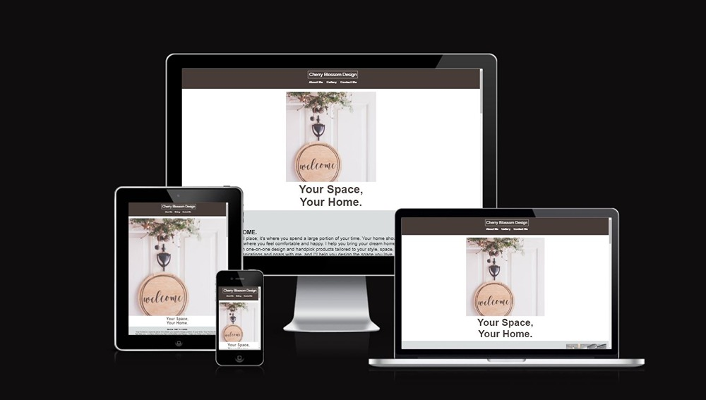
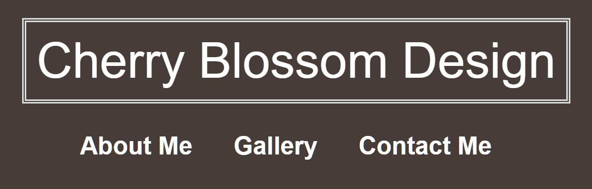

# Cherry Blossom Design 

[You can view the live page here!]( https://pixie-pie.github.io/Cherry-Blossom-Design/)

## Purpose of Cherry Blossom Design
I created this website because I am extremely interested in interior design, blueprints, and architecture. The purpose of this website is as follows: This website was created to showcase the work of a fictional interior designer named Cherry Blossom, who resides in Santa Barbara, California, USA. The primary goal of this website is to display her most significant interior design projects, attracting a new client base, promoting her work, and introducing her to potential clients. 

Additionally, it serves as an easy means for potential clients to contact her via messages, email, social media platforms, or WhatsApp messages.

This is the first website I have ever created, and it represents my initial project for the Software Development Diploma at The Code Institute.
The project requirements included creating a static and responsive website with multiple sections, a navigation bar, a contact form, and a footer using HTML and CSS.

## UX
The website is presented in a minimalistic and effective manner, offering all essential information on a single page. The navigation bar is user-friendly, providing easy access to key sections, including the About Me, Gallery, and Contact Me sections, which I believe are the most crucial elements of any website.

### Colour Scheme
- `#FFFFFF` was consistently used throughout the website. It served as the font colour for the navigation bar, as well as the background colour for the hero section, about me section, and contact section of the website. Additionally, it was utilized as the background colour for the 'thank you' page that appears after submitting your information via the form.
- `#473C38` was used as the font colour below the hero image and as the colour of the navigation bar.
- `#DADDDE` was used as the background color for both welcome section  and the footer.
- `#000000` was the main font colour used across the different sections of the website, and it was also the colour of the icons in the footer.
- `#E6E5E1` was used as the background colour for the gallery section. 
- `#6B1C02`was used a the colour of the signature under the picture of Cherry Blossom. 

  I used [canva.com](https://canva.com) to help me with the colour palette.

### Fonts
I used Google Fonts across two sections of the webste. 
- [Allura](https://fonts.google.com/specimen/Allura?query=allura) was used for Cherry Blossom’s signature.
- [Dosis](https://fonts.google.com/specimen/Dosis?query=Dosis&preview.size=18) was used for the nav bar logo. 

### Icons
Font Awesome was used for the icons on the footer.
- [Instagram logo](https://fontawesome.com/icons/square-instagram?f=brands&s=solid)
- [WhatsApp logo](https://fontawesome.com/icons/whatsapp?f=brands&s=solid)
- [Email logo](https://fontawesome.com/icons/envelope?f=classic&s=solid)

### Structure 
**Header** 
- Logo - Positioned in the center, with the navigation bar directly below it. Clicking the logo takes you to the top of the page, while each navigation section brings you to the desired section of the web page. The navigation bar appears on every page.

**Home page**
- Hero Image - Appears centered at the top of the page, with a heading underneath it.
- Inspiration - This section features an inspirational quote with an image of a kitchen and living room interior design placed horizontally to the right of the text.
- About me - This section is centered vertically and includes a brief history of Cherry Blossom, outlining her education, discussing her work, listing her awards, and featuring a quote. Beneath the text, there is an image of Cherry Blossom, and underneath the picture, her signature is displayed in a cursive font.
- View my work - This is the gallery section that displays a grid with two pictures per row, totaling three grids. Each picture in the grid includes the name of the project, the year it was designed, and the client's budget.
- Contact me - This is the contact section where you can input your information, including your Name, Email, and Message, into a form. Submitting the form takes you to another page. Below the form horizontally, you can find the office's address information.

**Footer**
- Footer - contains social media links, which are present on every page. These links are accompanied by clickable icons that lead directly to the web versions of their respective social media platforms.

## Wireframes 
[Balsamiq]( https://balsamiq.com/wireframes/) was used to create the wireframes. 

[Placeholder for wireframes]
