# Cherry Blossom Design 

[You can view the live page here!]( https://pixie-pie.github.io/Cherry-Blossom-Design/)
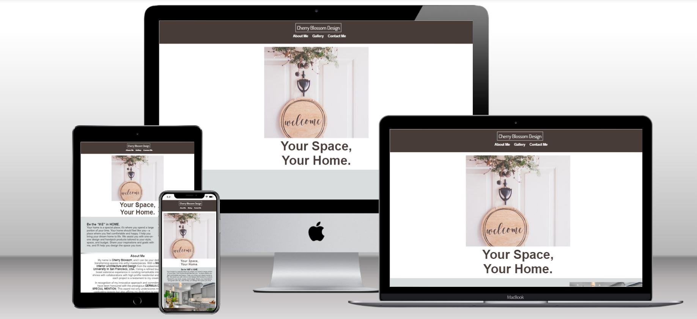

## Purpose of Cherry Blossom Design:
I created this website because I am extremely interested in interior design, blueprints, and architecture. The purpose of this website is as follows: This website was created to showcase the work of a fictional interior designer named Cherry Blossom, who resides in Santa Barbara, California, USA. The primary goal of this website is to display her most significant interior design projects, attracting a new client base, promoting her work, and introducing her to potential clients. 

Additionally, it serves as an easy means for potential clients to contact her via messages, email, social media platforms, or WhatsApp messages.

This is the first website I have ever created, and it represents my initial project for the Software Development Diploma at The Code Institute.
The project requirements included creating a static and responsive website with multiple sections, a navigation bar, a contact form, and a footer using HTML and CSS.

## UX:
The website is presented in a minimalistic and effective manner, offering all essential information on a single page. The navigation bar is user-friendly, providing easy access to key sections, including the About Me, Gallery, and Contact Me sections, which I believe are the most crucial elements of any website.

### Colour Scheme:
- `#FFFFFF` was consistently used throughout the website. It served as the font colour for the navigation bar, as well as the background colour for the hero section, about me section, and contact section of the website. Additionally, it was utilized as the background colour for the 'thank you' page that appears after submitting your information via the form.
- `#473C38` was used as the font colour below the hero image and as the colour of the navigation bar.
- `#DADDDE` was used as the background color for both welcome section  and the footer.
- `#000000` was the main font colour used across the different sections of the website, and it was also the colour of the icons in the footer.
- `#E6E5E1` was used as the background colour for the gallery section. 
- `#6B1C02`was used a the colour of the signature under the picture of Cherry Blossom. 

  I used [canva.com](https://canva.com) to help me with the colour palette.

### Fonts:
I used Google Fonts across two sections of the webste. 
- [Allura](https://fonts.google.com/specimen/Allura?query=allura) was used for Cherry Blossom’s signature.
- [Dosis](https://fonts.google.com/specimen/Dosis?query=Dosis&preview.size=18) was used for the nav bar logo. 

### Icons:
Font Awesome was used for the icons on the footer.
- [Instagram logo](https://fontawesome.com/icons/square-instagram?f=brands&s=solid)
- [WhatsApp logo](https://fontawesome.com/icons/whatsapp?f=brands&s=solid)
- [Email logo](https://fontawesome.com/icons/envelope?f=classic&s=solid)

### Structure:
**Header** 
- Logo - Positioned in the center, with the navigation bar directly below it. Clicking the logo takes you to the top of the page, while each navigation section brings you to the desired section of the web page. The navigation bar appears on every page.

**Home page**
- Hero Image - Appears centered at the top of the page, with a heading underneath it.
- Inspiration - This section features an inspirational quote with an image of a kitchen and living room interior design placed horizontally to the right of the text.
- About me - This section is centered vertically and includes a brief history of Cherry Blossom, outlining her education, discussing her work, listing her awards, and featuring a quote. Beneath the text, there is an image of Cherry Blossom, and underneath the picture, her signature is displayed in a cursive font.
- View my work - This is the gallery section that displays a grid with two pictures per row, totaling three grids. Each picture in the grid includes the name of the project, the year it was designed, and the client's budget.
- Contact me - This is the contact section where you can input your information, including your Name, Email, and Message, into a form. Submitting the form takes you to another page. Below the form horizontally, you can find the office's address information.

**Footer**
- Footer - contains social media links, which are present on every page. These links are accompanied by clickable icons that lead directly to the web versions of their respective social media platforms.

### User Stories:
#### New user stories
- As a homeowner, I want to use the contact form to collaborate with an interior designer to transform my living room into a cozy and modern space where my family can relax and entertain guests.
- As a business owner, I want to look at the previous work of this interior designer to see if she  created a functional and modern office in the past.
- As a real estate developer, I require an interior designer to stage and decorate model homes to make them more appealing to potential buyers. I want to find out where this interior designer is based in Santa Barbara. 
- As a newlywed couple, we are contemplating the idea of redecorating our home but are uncertain about proceeding with this project. We seek inspiration to help us determine whether we want to move forward.

#### Returning member stories 
- As a returning member, I want to communicate with my assigned interior designer through the platform to discuss any changes or updates to my ongoing projects.
- As a returning member, I want to check if the interior designer has included our project in their gallery for showcasing their work.
- As a returning member, I want to find out if the interior designer has relocated their office or studio.
- As a returning member, I want to access the contact details for the interior designer's office so that I can refer my friends and family to their services with ease.

## Wireframes:
[Balsamiq](https://balsamiq.com/wireframes/) was used to create the wireframes. 

- **Wireframe for main page**
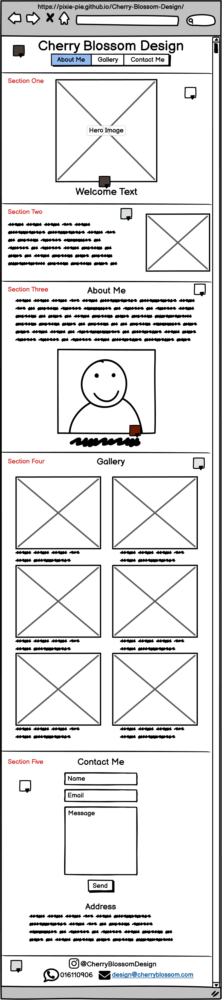

- **Wireframe for 'Thank you' page**

## Media Responsiveness:
### iPad

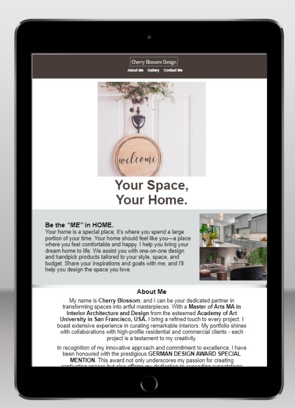
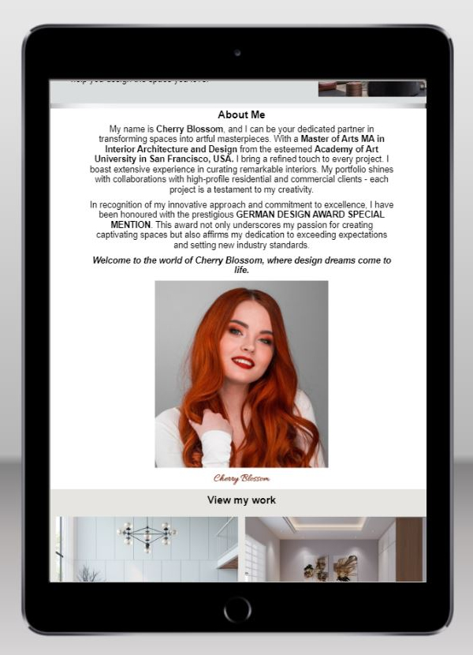

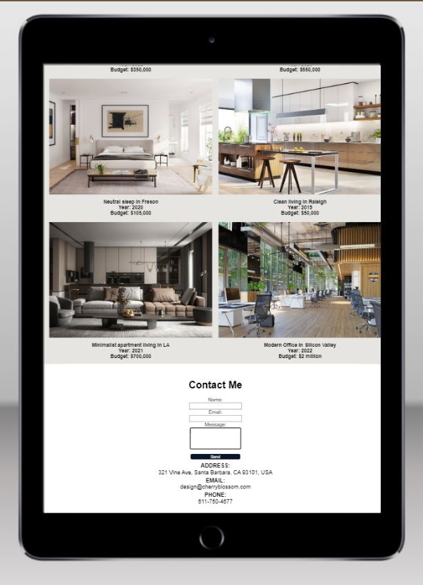

### iPhone

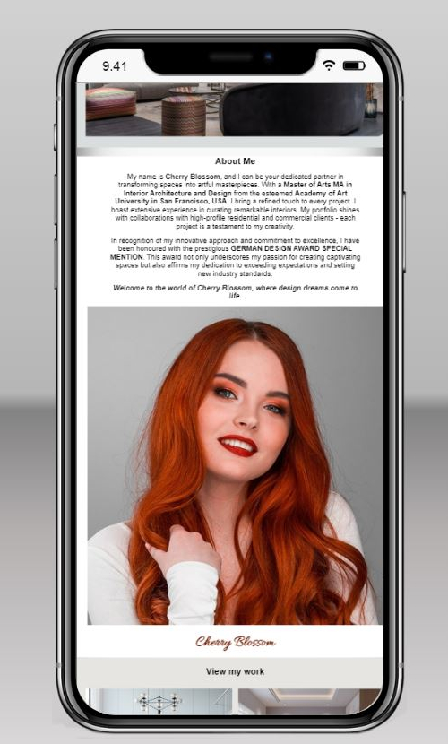
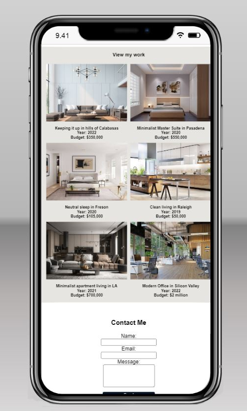

## Features:
**Responsive Navigation Bar**
- The navigation bar is visible on both the main page and the 'Thank You' page. However, clicking the logo on the main page scrolls to the top but in the 'Thank You' page it returns you to the main page.
- When you press the 'About Me' button, you are taken down to the 'About Me' section of the page. 
- When you click on 'Gallery,' you are taken to the 'Gallery' Section, which consists of a 2x3 grid containing multiple pictures of interior designs.
- Clicking 'Contact Me' takes you to the 'Contact Me' section at the bottom of the page. There, you can either fill out a contact form or use Cherry Blossom's displayed contact details.
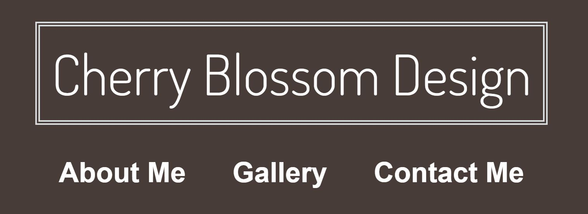

**Responsive form**

- This project features a Contact page with an interactive form that allows users to provide their name, email address, and a message. However, it's important to note that this project does not include a server to store user data. Instead of a traditional "send" action, when users submit the form, it redirects them to the 'Thank you' page displaying a thank-you message.
- Users are required to accurately fill out all section boxes. Any discrepancies or insufficiencies in the provided information will prompt an alteration. For instance, if a user fails to include the "@" symbol in their email address, the form will generate a notification informing the user about the missing "@" symbol.
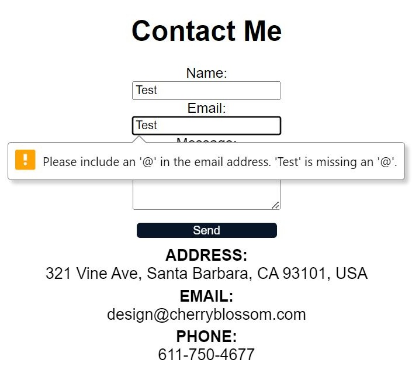
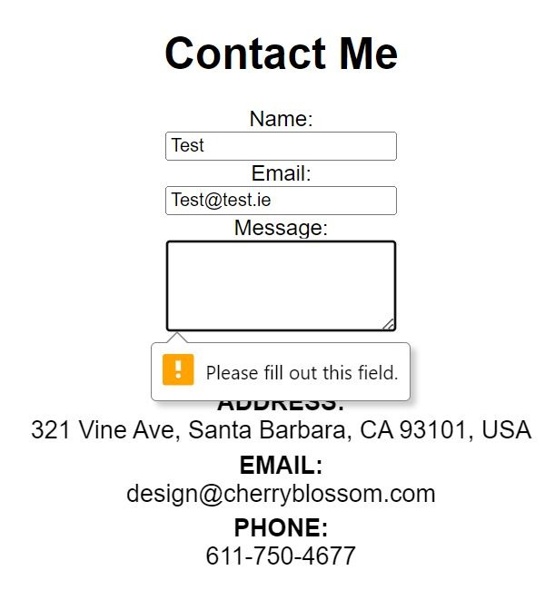
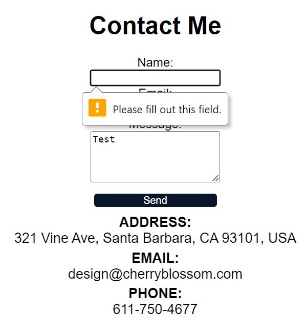

**Action from the form**

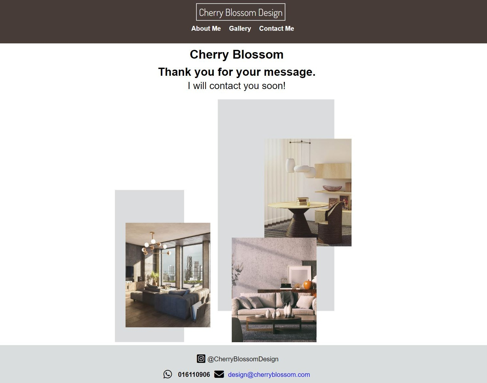
- When the user inputs information into all the section boxes and presses the 'Send' button, they will be automatically redirected to the 'Thank You' page, which opens in the same tab.

**Responsive Footer**
- The footer contains icons that link to various websites: the Instagram icon directs you to https://www.instagram.com/, the phone icon takes you to https://api.whatsapp.com/send?phone=6117504677, and the email icon opens your preferred email application.
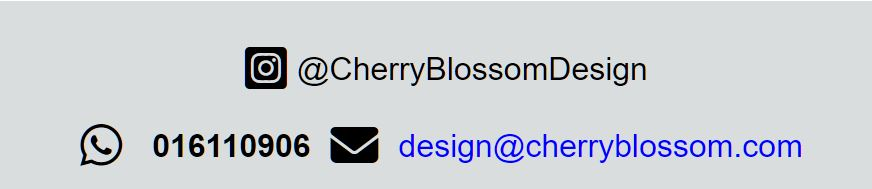

## Testing:
**I used the [W3C CSS Validation service](https://jigsaw.w3.org/css-validator/) to validate my CSS code, and no errors were found.**

    

**For my HTML, I utilized the [W3C Markup Validation Service](https://validator.w3.org/), and no errors were detected.**

    

**However, during the Lighthouse testing stage, I encountered errors related to performance and accessibility:**

-	The image sizes were initially too large and lacked a height property. I reduced the pixel dimensions; however, there were still errors due to the width and height properties causing delayed responses.

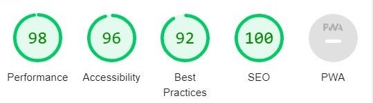

-	To address this issue, I used [RedKetchup](redketchup.io/image-resizer) to adjust the width and height of the pictures, which improved the performance but it lowered the accessibility.

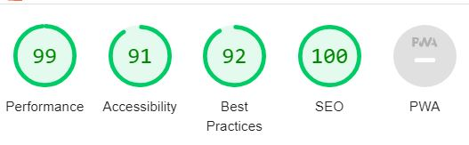

-	There was also an issue with the "aria-label" attribute, as it did not match the Font Awesome properties. I made the necessary corrections, resulting in improved overall accessibility score.

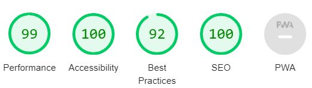

-	The image files were resized again, and CSS max-width and max-height were adjusted. I used Google to find out the ideal size for images to be added to the website so that they don't affect performance and accessibility. The overall score was 100% across all Lighthouse scores.

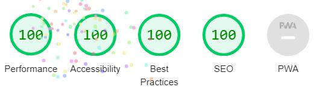

## Technology used:
- **HTML:** Used for the codebase of both the index and 'thank you' pages.
- **CSS:** Utilized for styling on both the index and 'thank you' pages, with additional use of Flexbox and Grid resources.
- **GitHub:** Used for version control and code storage.
- **GitHub Pages:** Deployed the website to GitHub Pages for hosting.
- **Gitpod:** Used as the integrated development environment (IDE) for development.
- **Canva:** Was used for creating and editing images and establishing the colour palette.
- **Red Ketchup** Was used to resize all the images on my website. 

## Acknowledgements
-  I would like to express my thanks and gratitude to the entire [Code Institute](https://codeinstitute.net/ie/) team for providing additional assistance when needed and for their understanding of my circumstances.
- I would like to thank my mentor [David Bowers](https://github.com/dnlbowers) for constant support, words of encouragement, and all the assistance he provided to me during this project.
- [Jonathan Zakrisson](https://github.com/Jonathan97-web) for the countless hours of study and support, and the encouragement to never give up.
- [Craig Hudson](https://github.com/Craig-Hudson) for always answering any questions I had regarding this project.
- I would like to thank [Harry Dhillon](https://github.com/Harry-Leepz), who has been a massive support throughout my journey at Code Institute.
- Finally, I would like to thank my partner Stephen and my whole family who have supported me, encouraged me, and for picking up my day-to-day schedule when I needed to work countless hours to get this project done on time.
